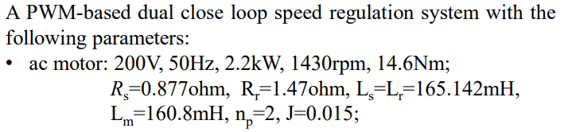
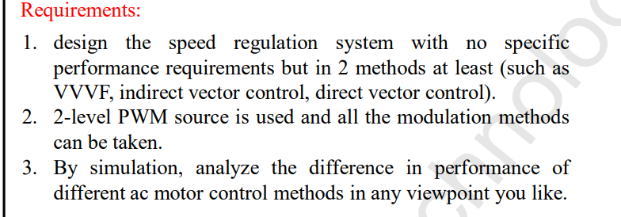
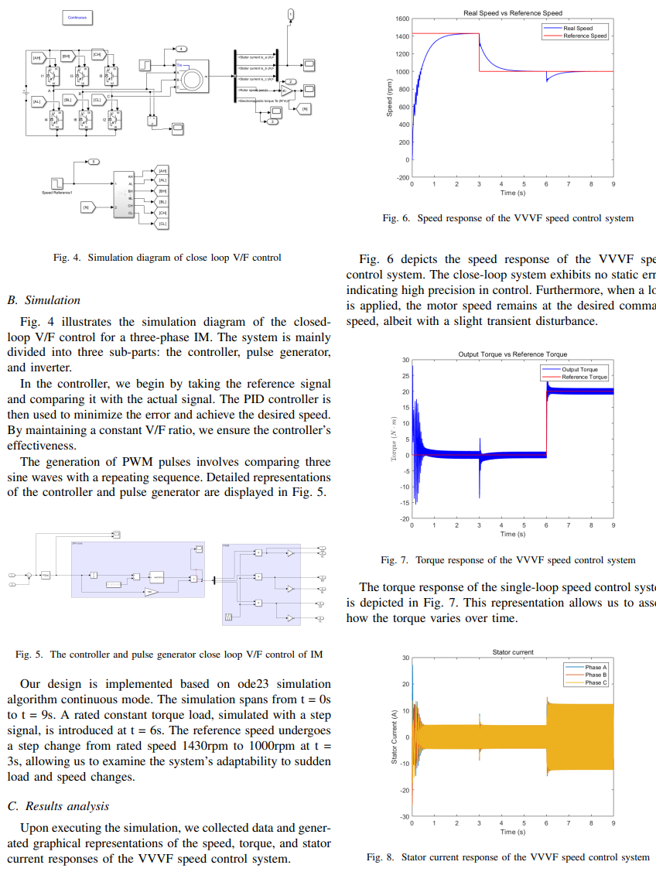
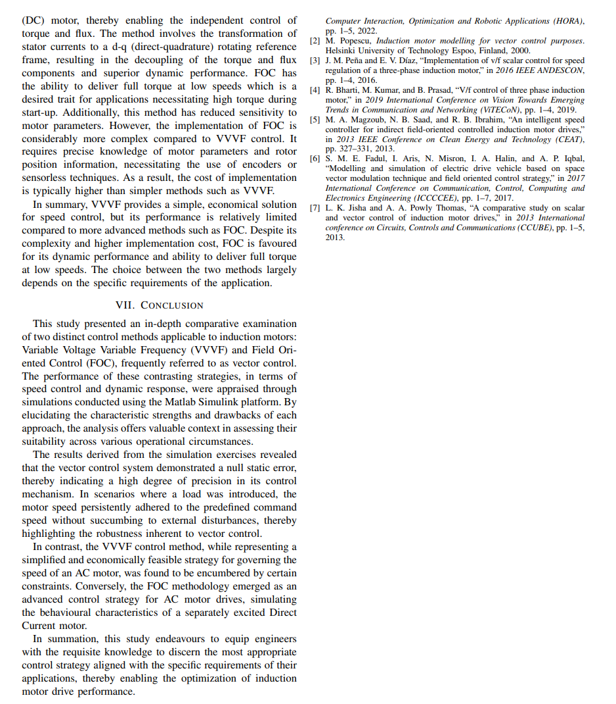

# Induction-Motor-Control-Simulation
This is a collection of Induction motor(asychonous motor) controlling methods simulation. VVVF, FOC and DTC will be implemented using Matlab Simulink in my design.

## Requirement 

## Simulation model

### [Direct Torque Control (DTC)](Project/DTC/DTC.slx)

### [Field Oriented Control (FOC)](Project/FOC/foc.slx)

### [Vary Voltage Vary Frequency Control (VVVF)](Project/VVVF)

## [Report](Induction_Motor_Simulation_Report.pdf)

